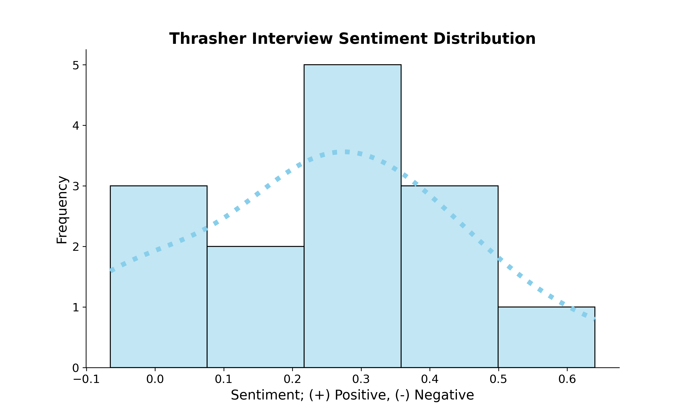

# Thrasher Interview Sentiment Data Pipeline

## Purpose
Extracts Q&A text from interview articles on [Thrashermagazine.com](https://www.thrashermagazine.com/articles-and-interviews/). This text is placed
into a local Postgres database and further transformed through two DBT models. These models
prep the data for langauge processing by removing punctuation and single instances of letters.
The prepped data is then extracted and processed to remove stop words and prep for tokenization.
Using [NLTK](https://www.nltk.org/), tokens are then evaluated for sentiment using the `SentimentIntensityAnalyzer` method 
and assigned a value ranging -1 to 1. This data is aggregated to an average of all sentiment values 
contained between questions and answers in the interview.

## Data Pipeline Structure

## Tooling
1. Pandas
2. Seaborn
3. Postgres
4. Selenium
5. SqlAlchemy
6. BeautifulSoup
7. Apache Airflow
8. DBT (Data Build Tool)

## Airflow Dag

## Sentiment Distribution

